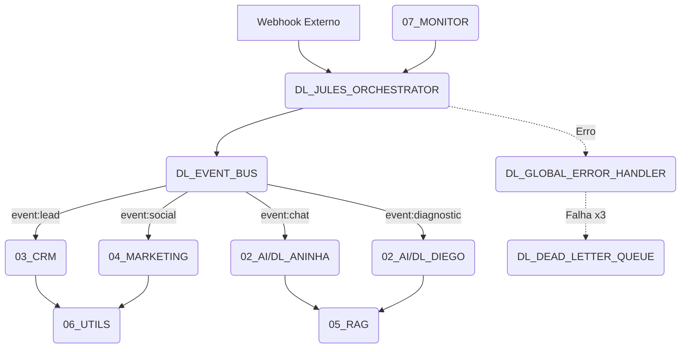

# FASE 0 — ARCHITECTURE FREEZE (DL NEXUS)

## 1. Mapa Completo da Arquitetura

- **01_CORE**: Orquestração central (Jules), filas (Event Bus, DLQ, Scheduler), tratamento de erros (Global Error Handler) e logs.
- **02_AI**: Agents (Aninha Chatbot, Diego Diagnostic) e pool de especialistas.
- **03_CRM**: Gestão de leads, follow-ups, orçamentos e contratos.
- **04_MARKETING**: Geradores de conteúdo (texto, imagem, vídeo), publicação social e métricas.
- **05_RAG**: Indexador de base de conhecimento, processador de queries e importador de documentos.
- **06_UTILS**: Integrações atômicas (Google Drive, Email, Telegram, PDF, OCR).
- **07_MONITOR**: Healthchecks do ecossistema, analytics e sistema de alertas.
- **08_BUSINESS**: Motores de proposta, cross-sell, upsell, lead scoring e KPI manager.

## 2. Resolução de Conflitos e Responsabilidades

- **DL-Jules**: ÚNICO orquestrador autorizado a invocar sub-workflows core.
- **DL-Aninha**: Central de atendimento e CRM front-end.
- **DL-Diego**: Diagnóstico técnico e infraestrutura.
- **Regra de Duplicidade**: Nenhuma rotina de API (ex: enviar Telegram) pode ser reinventada; deve sempre invocar o `06_UTILS/DL_UTIL_TELEGRAM`.

## 3. Validação de Dependências

- Todo webhook externo entra via `DL_JULES_ORCHESTRATOR` (ou APIGateway configurado) -> Envia ao `DL_EVENT_BUS` -> Processado assincronamente pelo módulo responsável.
- Banco de Dados Central: `Supabase` (idempotência obrigatória).
- Armazenamento Central de Docs: `Google Drive`.

## 4. Grafo de Dependências (Mermaid)

## 5. Princípio Open-Closed (Extensibilidade)
Toda funcionalidade nova deverá poder ser adicionada sem modificar workflows existentes, utilizando apenas:
- novos eventos;
- novos subworkflows;
- novas feature flags;
- novas configurações.
**Proibido introduzir breaking changes em integrações core.**
