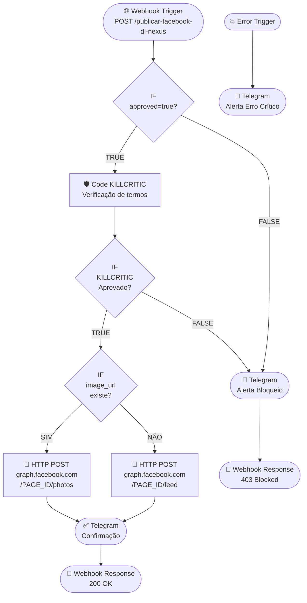

# RELATÓRIO TÉCNICO — 082_PUBLICADOR_FACEBOOK_META_API
**DL Nexus V3 · DL Soluções Condominiais · Marketing Automatizado**

---

## Informações Gerais

| Campo | Valor |
|---|---|
| **Workflow ID** | `082_PUBLICADOR_FACEBOOK_META_API` |
| **Versão** | 1.0.0 |
| **Data de Criação** | 2026-05-22 |
| **Status** | ✅ PRONTO PARA IMPORTAÇÃO |
| **active** | `false` (obrigatório até configuração completa) |
| **KILLCRITIC** | ✅ Implementado |
| **approved gate** | ✅ Implementado |
| **WhatsApp** | ❌ Ausente (conformidade com regras DL Nexus) |
| **Tokens/Secrets no JSON** | ❌ Nenhum |

---

## Localização dos Arquivos

| Pasta | Arquivo | Propósito |
|---|---|---|
| `12_N8N_WORKFLOWS_PROXIMOS` | `082_PUBLICADOR_FACEBOOK_META_API.json` | Versão de desenvolvimento/revisão |
| `20_UPLOAD_N8N` | `082_PUBLICADOR_FACEBOOK_META_API_config.json` | Metadados de configuração e checklist de implantação |
| `09_PRONTOS_PARA_PRODUCAO` | `082_PUBLICADOR_FACEBOOK_META_API.json` | Versão aprovada para produção |
| `05_RELATORIOS` | `RELATORIO_082_PUBLICADOR_FACEBOOK_META_API.md` | Este documento |

---

## Arquitetura do Workflow



---

## Detalhamento dos Nós

### 1. Webhook Trigger — Publicar Facebook
- **Tipo:** `n8n-nodes-base.webhook` v2
- **Método:** `POST`
- **Path:** `publicar-facebook-dl-nexus`
- **Response Mode:** `responseNode` (responde após toda a execução)

### 2. IF: approved=true?
- **Condição:** `$json.body.approved === true` (strict boolean)
- **Caminho TRUE →** Code KILLCRITIC
- **Caminho FALSE →** Telegram Alerta Bloqueio

### 3. Code KILLCRITIC — Verificação de Termos
- **Tipo:** `n8n-nodes-base.code` v2
- **Modo:** `runOnceForAllItems`

**Validações executadas (em ordem):**
1. Campo `message` não pode ser vazio
2. Mínimo de 10 caracteres na mensagem
3. Máximo de 63.206 caracteres (limite do Facebook)
4. Verificação contra lista de **termos proibidos** (14 termos)
5. Exigência de pelo menos 1 **termo de contexto DL** (9 termos)
6. Validação de URL de imagem quando `image_url` fornecida

**Termos proibidos monitorados:**
```
garantimos retorno | lucro garantido | sem risco | investimento seguro
proibido | ilegal | whatsapp | zap | clique aqui e ganhe
grátis por tempo limitado | urgente!!! | imperdível!!! | milagre
cpf | senha | token | api_key | secret
```

**Termos de contexto obrigatório (ao menos 1):**
```
avaliação técnica | avaliacao tecnica | diagnóstico | diagnóstico gratuito
visita técnica | visita tecnica | dl soluções | dl solucoes
condomínio | condominio
```

**Saídas do nó Code:**
```json
{
  "killcritic_status": "APROVADO | BLOQUEADO",
  "killcritic_motivo": "Descrição detalhada",
  "killcritic_aprovado": true | false,
  "killcritic_timestamp": "2026-05-22T20:01:59.000Z"
}
```

### 4. IF: KILLCRITIC Aprovado?
- **Condição:** `$json.killcritic_aprovado === true`
- **Caminho TRUE →** IF image_url existe?
- **Caminho FALSE →** Telegram Alerta Bloqueio

### 5. IF: image_url existe?
- **Condição:** `$json.body.image_url` não é vazio (typeValidation: loose)
- **Caminho TRUE (com imagem) →** HTTP POST /photos
- **Caminho FALSE (sem imagem) →** HTTP POST /feed

### 6. HTTP POST: Facebook /photos (com imagem)
- **URL:** `https://graph.facebook.com/v19.0/PAGE_ID_AQUI/photos`
- **Credencial:** `Aplicativo do Facebook` (facebookGraphApi)
- **Parâmetros Body:**
  - `message` → `{{ $json.body.message }}`
  - `url` → `{{ $json.body.image_url }}`
  - `published` → `true`
- **Timeout:** 30.000ms

### 7. HTTP POST: Facebook /feed (sem imagem)
- **URL:** `https://graph.facebook.com/v19.0/PAGE_ID_AQUI/feed`
- **Credencial:** `Aplicativo do Facebook` (facebookGraphApi)
- **Parâmetros Body:**
  - `message` → `{{ $json.body.message }}`
- **Timeout:** 30.000ms

### 8. Telegram: Confirmação de Publicação
- **chatId:** `CHAT_ID_AQUI`
- **Credencial:** `Conta do Telegram`
- **Formato:** Markdown
- **Conteúdo:** Post ID, preview da mensagem, horário (Brasília), status KILLCRITIC

### 9. Telegram: Alerta de Bloqueio KILLCRITIC
- **chatId:** `CHAT_ID_AQUI`
- **Credencial:** `Conta do Telegram`
- **Gatilhos:** approved=false OU KILLCRITIC reprovado
- **Conteúdo:** Motivo do bloqueio + orientação de correção

### 10 & 11. Webhook Responses
| Response | HTTP Code | Gatilho |
|---|---|---|
| Sucesso | `200 OK` | Após Telegram confirmação |
| Bloqueado | `403 Forbidden` | Após Telegram alerta bloqueio |

### 12. Error Trigger + Telegram Erro Crítico
- **Tipo:** `n8n-nodes-base.errorTrigger`
- Captura qualquer exceção não tratada no workflow
- Notifica via Telegram com: mensagem de erro, último nó executado, Execution ID e timestamp

---

## Placeholders Obrigatórios para Ativação

> [!CAUTION]
> **NUNCA ative o workflow sem substituir todos os placeholders abaixo.** Executar com `PAGE_ID_AQUI` fará as requisições falharem com erro 400 da Meta API.

| Placeholder | Onde substituir | Como obter |
|---|---|---|
| `PAGE_ID_AQUI` | URLs dos nós HTTP POST (photos e feed) | Facebook Business Manager → Páginas → ID da Página |
| `CHAT_ID_AQUI` | Todos os 3 nós Telegram | `@userinfobot` no Telegram ou configurações do grupo |

---

## Credenciais Necessárias

| Nome no n8n | Tipo | Permissões |
|---|---|---|
| `Aplicativo do Facebook` | `facebookGraphApi` | `pages_manage_posts`, `pages_read_engagement` |
| `Conta do Telegram` | `telegramApi` | Bot Token com acesso ao chat |

> [!NOTE]
> O token de acesso à Página do Facebook (Page Access Token) deve ser de longa duração (long-lived). Tokens de curta duração expiram em 1 hora. Use o Facebook Token Debugger para verificar a validade.

---

## Payload de Entrada

### Post com imagem
```json
{
  "approved": true,
  "message": "🏢 A DL Soluções Condominiais realiza avaliação técnica gratuita no seu condomínio! Energia solar, CFTV e automação predial no Rio de Janeiro. Solicite sua visita técnica agora.",
  "image_url": "https://seu-servidor.com/imagens/dl-solucoes-post.jpg"
}
```

### Post sem imagem (apenas texto)
```json
{
  "approved": true,
  "message": "🌞 DL Soluções Condominiais: economia de até 95% na conta de energia com instalação de energia solar! Agende sua avaliação técnica gratuita para o seu condomínio no Rio de Janeiro."
}
```

### Payload rejeitado (exemplo)
```json
{
  "approved": false,
  "message": "Qualquer coisa"
}
```
**Resultado:** HTTP 403 + Telegram alerta bloqueio

---

## Respostas do Webhook

### Sucesso (HTTP 200)
```json
{
  "status": "success",
  "workflow": "082_PUBLICADOR_FACEBOOK_META_API",
  "facebook_post_id": "123456789_987654321",
  "killcritic_status": "APROVADO",
  "timestamp": "2026-05-22T23:01:59.000Z"
}
```

### Bloqueado (HTTP 403)
```json
{
  "status": "blocked",
  "workflow": "082_PUBLICADOR_FACEBOOK_META_API",
  "killcritic_status": "BLOQUEADO",
  "motivo": "Post não menciona contexto DL / condomínio / avaliação técnica.",
  "timestamp": "2026-05-22T23:01:59.000Z"
}
```

---

## Checklist de Ativação

> [!IMPORTANT]
> Execute esta checklist **na ordem** antes de definir `active: true` no n8n.

- [ ] **1.** Importar o JSON no n8n (Menu → Workflows → Import)
- [ ] **2.** Substituir `PAGE_ID_AQUI` pelo ID real da Página do Facebook nos 2 nós HTTP
- [ ] **3.** Substituir `CHAT_ID_AQUI` pelo Chat ID real nos 3 nós Telegram
- [ ] **4.** Configurar a credencial `Aplicativo do Facebook` com Page Access Token de longa duração
- [ ] **5.** Configurar a credencial `Conta do Telegram` com Bot Token
- [ ] **6.** Executar manualmente com payload de teste SEM imagem → verificar post no Facebook e notificação no Telegram
- [ ] **7.** Executar manualmente com payload de teste COM imagem → verificar post no Facebook e notificação no Telegram
- [ ] **8.** Testar payload com `approved: false` → confirmar bloqueio e retorno 403
- [ ] **9.** Testar payload com termo proibido → confirmar bloqueio KILLCRITIC
- [ ] **10.** Confirmar que o `Error Trigger` está conectado ao nó Telegram de erro
- [ ] **11.** Definir `active: true` somente após todos os itens acima confirmados

---

## Segurança e Conformidade DL Nexus V3

| Regra | Status |
|---|---|
| `active: false` no JSON gerado | ✅ Conforme |
| Zero tokens/API keys no arquivo | ✅ Conforme |
| Zero senhas no arquivo | ✅ Conforme |
| Credenciais referenciadas apenas por nome | ✅ Conforme |
| Placeholders presentes e documentados | ✅ Conforme |
| KILLCRITIC obrigatório implementado | ✅ Conforme |
| `approved=true` gate implementado | ✅ Conforme |
| Sem referência a WhatsApp | ✅ Conforme |
| Error Trigger presente | ✅ Conforme |
| JSON válido para importação n8n | ✅ Conforme |

---

## Integrações com o Ecossistema DL Nexus V3

Este workflow pode ser chamado pelos seguintes agentes/workflows:

| Caller | Como integrar |
|---|---|
| `11_N8N_AGENTES_V3` - Agente de Marketing | `HTTP Request POST` → endpoint do webhook |
| `10_MARKETING_RECURRENCIA` - Publicação agendada | `Schedule Trigger` → `HTTP Request` → webhook |
| Manus (estratégia de conteúdo) | Gera o `message` e envia via HTTP com `approved: true` |
| Kimiclaw (executor) | Faz testes de volume com payloads variados |

> [!TIP]
> Para publicações agendadas, crie um workflow separado com `Schedule Trigger` que monta o payload e chama este webhook. Isso mantém a separação de responsabilidades e permite auditar cada publicação independentemente.

---

## Histórico de Versões

| Versão | Data | Alteração |
|---|---|---|
| 1.0.0 | 2026-05-22 | Criação inicial — estrutura completa com KILLCRITIC, dual-path foto/feed, Telegram e Error Trigger |

---

*Gerado automaticamente pelo DL Nexus V3 Arquiteto de Automação · DL Soluções Condominiais LTDA*
