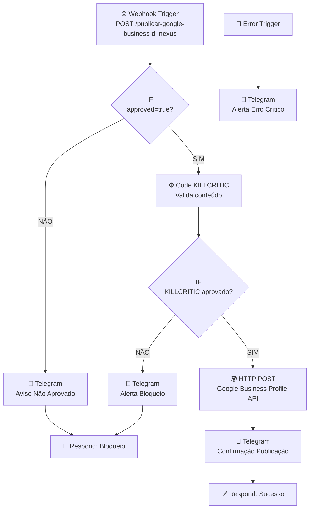

# RELATÓRIO TÉCNICO — 083_PUBLICADOR_GOOGLE_BUSINESS_PROFILE
**DL Nexus V3 | DL Soluções Condominiais**
**Data:** 22/05/2026 | **Versão:** 1.0.0 | **Status:** ✅ Pronto para Deploy

---

## 1. VISÃO GERAL

O workflow `083_PUBLICADOR_GOOGLE_BUSINESS_PROFILE` automatiza a publicação de posts no **Google Business Profile** (antigo Google Meu Negócio) da DL Soluções Condominiais via API REST, com tripla camada de segurança: aprovação humana (`approved=true`), validação KILLCRITIC e tratamento de erros via Error Trigger.

> [!IMPORTANT]
> Este workflow requer configuração **manual e obrigatória** de uma credencial **OAuth2** no n8n antes de qualquer execução. Sem essa credencial, a publicação **não ocorrerá**.

---

## 2. ARQUITETURA DO FLUXO



### Nós do Workflow

| # | Nó | Tipo | Função |
|---|-----|------|--------|
| 1 | Webhook Trigger | Webhook | Recebe o payload POST |
| 2 | IF: approved=true | IF | Valida aprovação humana |
| 3 | Code KILLCRITIC | Code (JS) | Valida conteúdo antes de publicar |
| 4 | IF: KILLCRITIC aprovado | IF | Controle de fluxo pós-validação |
| 5 | HTTP Request: POST GBP | HTTP Request | Publica na API Google Business |
| 6 | Telegram: Confirmação | Telegram | Notifica sucesso |
| 7 | Telegram: Alerta Bloqueio | Telegram | Notifica bloqueio KILLCRITIC |
| 8 | Telegram: Aviso Não Aprovado | Telegram | Notifica falta de approved=true |
| 9 | Respond: Sucesso | Respond to Webhook | Retorna JSON de sucesso |
| 10 | Respond: Bloqueio | Respond to Webhook | Retorna JSON de bloqueio |
| 11 | Error Trigger | Error Trigger | Captura exceções globais |
| 12 | Telegram: Alerta Erro Crítico | Telegram | Notifica erros de execução |

---

## 3. CONFIGURAÇÃO OAUTH2 — PASSO A PASSO OBRIGATÓRIO

> [!CAUTION]
> O Google Business Profile API **não aceita API Keys simples**. Exige **OAuth 2.0** com consentimento do usuário proprietário da conta Google My Business. Este processo é **manual e não pode ser automatizado** pela DL Nexus.

### 3.1 Criar Projeto no Google Cloud Console

1. Acesse [console.cloud.google.com](https://console.cloud.google.com)
2. Crie um novo projeto: `DL-Nexus-GBP`
3. Ative as APIs:
   - **Google My Business API**
   - **Business Profile APIs**
4. Navegue para **APIs & Services → Credentials**
5. Clique em **Create Credentials → OAuth 2.0 Client IDs**
6. Tipo de aplicativo: **Web Application**
7. Authorized redirect URIs: `https://SEU_DOMINIO_N8N/rest/oauth2-credential/callback`

### 3.2 Configurar Credencial no n8n

```
n8n → Settings → Credentials → New Credential
Tipo: OAuth2 API
Nome: OAuth2 Google Business Profile

Authorization URL: https://accounts.google.com/o/oauth2/auth
Access Token URL: https://oauth2.googleapis.com/token
Client ID: [SEU_CLIENT_ID]
Client Secret: [SEU_CLIENT_SECRET]
Scope: https://www.googleapis.com/auth/business.manage
```

> [!WARNING]
> **Nunca insira o Client ID ou Client Secret diretamente no JSON do workflow.** Sempre use o gerenciador de credenciais do n8n.

### 3.3 Fluxo de Autorização

Após salvar a credencial no n8n, clique em **"Connect"** para iniciar o fluxo OAuth. Você será redirecionado para o Google para consentir o acesso à conta My Business.

---

## 4. OBTER GOOGLE_ACCOUNT_ID E GOOGLE_LOCATION_ID

> [!IMPORTANT]
> Os placeholders `GOOGLE_ACCOUNT_ID_AQUI` e `GOOGLE_LOCATION_ID_AQUI` **devem ser substituídos** com os valores reais antes de ativar o workflow.

### 4.1 Obter Account ID

Execute a chamada autenticada:

```http
GET https://mybusiness.googleapis.com/v4/accounts
Authorization: Bearer {access_token}
```

**Resposta esperada:**
```json
{
  "accounts": [
    {
      "name": "accounts/123456789",
      "accountName": "DL Soluções Condominiais",
      "type": "LOCATION_GROUP"
    }
  ]
}
```

O valor `"accounts/123456789"` é o seu `GOOGLE_ACCOUNT_ID`.

### 4.2 Obter Location ID

```http
GET https://mybusiness.googleapis.com/v4/accounts/123456789/locations
Authorization: Bearer {access_token}
```

**Resposta esperada:**
```json
{
  "locations": [
    {
      "name": "accounts/123456789/locations/987654321",
      "locationName": "DL Soluções Condominiais - Rio de Janeiro"
    }
  ]
}
```

O valor `"locations/987654321"` é o seu `GOOGLE_LOCATION_ID`.

### 4.3 Substituir no Workflow

No nó `HTTP Request: POST Google Business Profile`, substitua na URL:

```
DE: https://mybusiness.googleapis.com/v4/accounts/GOOGLE_ACCOUNT_ID_AQUI/locations/GOOGLE_LOCATION_ID_AQUI/localPosts
PARA: https://mybusiness.googleapis.com/v4/accounts/123456789/locations/987654321/localPosts
```

---

## 5. PAYLOAD DE TESTE

### Requisição de Sucesso

```bash
curl -X POST https://SEU_DOMINIO_N8N/webhook/publicar-google-business-dl-nexus \
  -H "Content-Type: application/json" \
  -d '{
    "approved": true,
    "texto": "A DL Soluções Condominiais oferece soluções completas em energia solar, CFTV e automação predial para condomínios no Rio de Janeiro. Solicite sua avaliação técnica gratuita!",
    "url_cta": "https://dlsolucoescondominiais.com"
  }'
```

### Resposta Esperada (Sucesso)

```json
{
  "status": "success",
  "mensagem": "Publicação enviada ao Google Business Profile com sucesso.",
  "workflow": "083_PUBLICADOR_GOOGLE_BUSINESS_PROFILE",
  "timestamp": "2026-05-22T23:02:00.000Z"
}
```

### Resposta Esperada (Bloqueio)

```json
{
  "status": "blocked",
  "mensagem": "Publicação bloqueada pelo KILLCRITIC ou por falta de aprovação.",
  "motivo": "Texto excede 1500 caracteres (limite do Google Business Profile).",
  "workflow": "083_PUBLICADOR_GOOGLE_BUSINESS_PROFILE",
  "timestamp": "2026-05-22T23:02:00.000Z"
}
```

---

## 6. REGRAS DO KILLCRITIC

| Regra | Valor | Ação se Violada |
|-------|-------|-----------------|
| Campo `approved` | Obrigatório | Bloqueio imediato |
| Campo `texto` | Obrigatório | Bloqueio imediato |
| Tamanho mínimo do texto | 10 caracteres | Bloqueio |
| Tamanho máximo do texto | 1.500 caracteres | Bloqueio |
| `whatsapp.com` no texto | Proibido | Bloqueio |
| `wa.me` no texto | Proibido | Bloqueio |
| `spam`, `fake` no texto | Proibido | Bloqueio |
| `promoção ilegal` no texto | Proibido | Bloqueio |

---

## 7. PLACEHOLDERS PARA CONFIGURAÇÃO

| Placeholder | Local no Workflow | Como Obter |
|-------------|-------------------|------------|
| `GOOGLE_ACCOUNT_ID_AQUI` | URL do nó HTTP Request | `GET /v4/accounts` autenticado |
| `GOOGLE_LOCATION_ID_AQUI` | URL do nó HTTP Request | `GET /v4/accounts/{id}/locations` |
| `CHAT_ID_AQUI` | Todos os nós Telegram (4x) | ID do grupo/chat Telegram da DL |
| `OAuth2 Google Business Profile` | Credencial do nó HTTP | Configurar manualmente no n8n |

---

## 8. LOCALIZAÇÃO DOS ARQUIVOS

| Arquivo | Diretório |
|---------|-----------|
| `083_PUBLICADOR_GOOGLE_BUSINESS_PROFILE.json` | `12_N8N_WORKFLOWS_PROXIMOS` |
| `083_PUBLICADOR_GOOGLE_BUSINESS_PROFILE.json` | `09_PRONTOS_PARA_PRODUCAO` |
| `083_PUBLICADOR_GOOGLE_BUSINESS_PROFILE_config.json` | `20_UPLOAD_N8N` |
| `RELATORIO_083_PUBLICADOR_GOOGLE_BUSINESS_PROFILE.md` | `05_RELATORIOS` |

---

## 9. CHECKLIST PRÉ-ATIVAÇÃO

- [ ] Credencial OAuth2 criada e autorizada no n8n
- [ ] `GOOGLE_ACCOUNT_ID_AQUI` substituído pelo ID real
- [ ] `GOOGLE_LOCATION_ID_AQUI` substituído pelo ID real
- [ ] `CHAT_ID_AQUI` substituído pelo ID do chat Telegram
- [ ] Teste com payload de validação executado
- [ ] Teste de bloqueio KILLCRITIC confirmado
- [ ] Error Trigger testado
- [ ] `active` alterado para `true` somente após todos os itens acima

> [!NOTE]
> Mantenha `active: false` durante toda a fase de configuração. Ative o workflow somente após validar todos os placeholders e credenciais.

---

## 10. LIMITAÇÕES E OBSERVAÇÕES DA API

- **Posts do tipo STANDARD** expiram após **7 dias** automaticamente no Google Business Profile
- A API `mybusiness.googleapis.com/v4` pode ser deprecada. Verifique a versão mais atual em [developers.google.com/my-business](https://developers.google.com/my-business)
- O escopo OAuth necessário é `https://www.googleapis.com/auth/business.manage`
- O usuário que autoriza o OAuth deve ser proprietário ou administrador da conta Google My Business
- Posts com imagens requerem parâmetro adicional `media` na requisição

---

*Gerado por DL Nexus V3 — Engenheiro de Integração Sênior Antigravity*
*22/05/2026 | Workflow 083 | v1.0.0*
