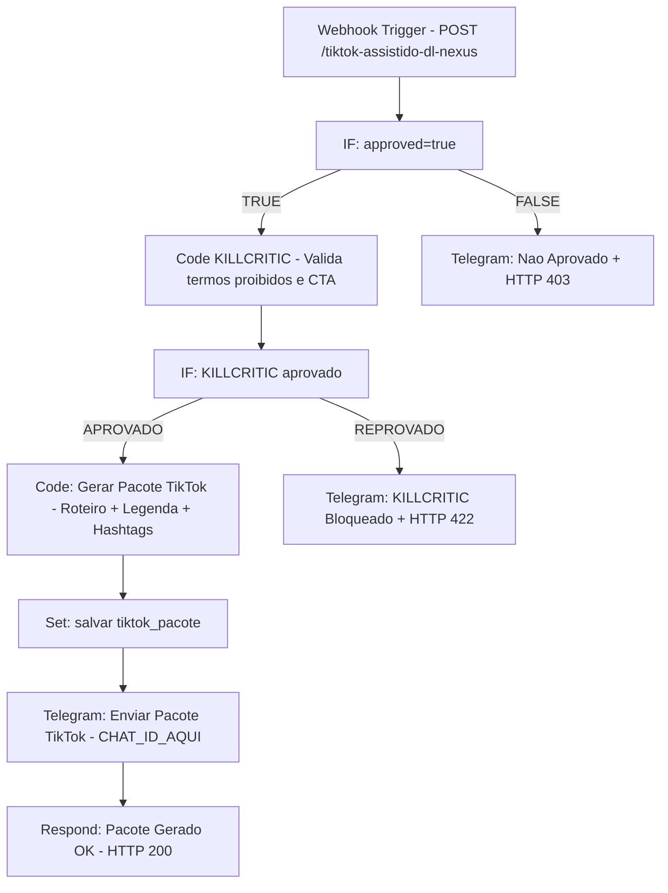

# RELATÓRIO 084 — PUBLICADOR TIKTOK ASSISTIDO
**DL Nexus V3 · DL Soluções Condominiais**
**Gerado em:** 2026-05-22 · **Status:** ✅ PRONTO PARA IMPORTAÇÃO

---

## 1. Identificação do Workflow

| Campo | Valor |
|---|---|
| **ID** | 084 |
| **Nome** | `084_PUBLICADOR_TIKTOK_ASSISTIDO` |
| **Categoria** | Marketing / TikTok / Assistido |
| **Modo de operação** | Geração de pacote — **SEM publicação automática** |
| **active** | `false` |
| **Versão** | 1.0.0 |
| **Webhook path** | `POST /webhook/tiktok-assistido-dl-nexus` |

---

## 2. Arquivos Gerados

| # | Destino | Arquivo |
|---|---|---|
| 1 | `12_N8N_WORKFLOWS_PROXIMOS` | `084_PUBLICADOR_TIKTOK_ASSISTIDO.json` |
| 2 | `20_UPLOAD_N8N` | `084_PUBLICADOR_TIKTOK_ASSISTIDO_config.json` |
| 3 | `09_PRONTOS_PARA_PRODUCAO` | `084_PUBLICADOR_TIKTOK_ASSISTIDO.json` |

---

## 3. Arquitetura do Fluxo



---

## 4. Detalhamento dos Nós

### 4.1 Webhook Trigger
- **Método:** POST
- **Path:** `tiktok-assistido-dl-nexus`
- **responseMode:** `responseNode` (resposta controlada por nó Respond)
- **webhookId:** `084-tiktok-assistido-dl-nexus`

### 4.2 IF: approved=true
- Verifica `$json.body.approved === "true"`
- **Branch TRUE:** segue para KILLCRITIC
- **Branch FALSE:** Telegram de bloqueio + Respond 403

### 4.3 Code KILLCRITIC

> [!IMPORTANT]
> O KILLCRITIC é obrigatório em todos os workflows de produção DL Nexus V3. Este nó valida o payload ANTES de qualquer geração de conteúdo.

**Termos proibidos verificados:**
- `visita técnica / visita tecnica`
- `garantia vitalícia / garantia vitalicia`
- `engenheiro diogo`
- `preço final / preco final`
- `preço fechado / preco fechado`
- `canaleta plástica / canaleta plastica`
- `hidráulica pura / hidraulica pura`
- `preço fechado automático / preco fechado automatico`

**Termos obrigatórios (ao menos 1):**
- `avaliação técnica / avaliacao tecnica`
- `tecnólogo / tecnologo`

**Saídas possíveis do campo `status_killcritic`:**
| Status | Significado |
|---|---|
| `APROVADO` | Nenhuma violação, CTA presente |
| `REPROVADO_TERMOS_PROIBIDOS` | Termo proibido detectado no payload |
| `REPROVADO_SEM_CTA_OBRIGATORIO` | Ausência de "avaliação técnica" ou "tecnólogo" |

### 4.4 IF: KILLCRITIC aprovado
- Verifica `$json.status_killcritic === "APROVADO"`
- **Branch TRUE:** Gera pacote TikTok
- **Branch FALSE:** Telegram de bloqueio + Respond 422

### 4.5 Code: Gerar Pacote TikTok

```javascript
const tema = $json.body.tema || 'N/A';
const produto = $json.body.produto || 'N/A';
const legenda = $json.body.texto || '';
const roteiro = '🎬 ROTEIRO TIKTOK DL SOLUÇÕES\n\n[0-3s] Hook: Mostre o problema do condomínio\n[3-10s] Apresente a solução: ' + produto + '\n[10-25s] Demonstre o resultado da Avaliação Técnica\n[25-30s] CTA: Fale com o Tecnólogo Responsável';
const hashtags = '#DLSolucoes #Condominio #Sindico #AvaliacaoTecnica #EngenhariaCondominal #RiodeJaneiro';
return { json: { roteiro, legenda_sugerida: legenda, hashtags, tema, produto,
  instrucao: 'Grave o vídeo seguindo o roteiro acima e poste manualmente no TikTok com a legenda e hashtags fornecidas.' } };
```

### 4.6 Set: salvar tiktok_pacote

| Campo de saída | Origem |
|---|---|
| `tiktok_pacote.roteiro` | `$json.roteiro` |
| `tiktok_pacote.legenda_sugerida` | `$json.legenda_sugerida` |
| `tiktok_pacote.hashtags` | `$json.hashtags` |
| `tiktok_pacote.tema` | `$json.tema` |
| `tiktok_pacote.produto` | `$json.produto` |
| `tiktok_pacote.instrucao` | `$json.instrucao` |
| `tiktok_pacote.pacote_gerado_em` | `$json.pacote_gerado_em` |
| `tiktok_pacote.workflow` | `$json.workflow` |

### 4.7 Telegram: Enviar Pacote TikTok
- **Credencial:** `Conta do Telegram` (sem token hardcoded)
- **Chat ID:** `CHAT_ID_AQUI` — placeholder obrigatório
- Envia roteiro completo, legenda sugerida, hashtags e instrução de postagem manual

---

## 5. Payload de Teste

```json
{
  "approved": "true",
  "tema": "Energia Solar em Condomínios",
  "produto": "DL Solar",
  "texto": "Reduza até 95% da conta de energia do seu condomínio. Fale com o Tecnólogo Responsável e agende sua Avaliação Técnica gratuita."
}
```

**Endpoint:**
```
POST https://SEU_N8N/webhook/tiktok-assistido-dl-nexus
Content-Type: application/json
```

**Resposta esperada (HTTP 200):**
```json
{
  "status": "PACOTE_TIKTOK_GERADO",
  "workflow": "084_PUBLICADOR_TIKTOK_ASSISTIDO",
  "tema": "Energia Solar em Condomínios",
  "produto": "DL Solar",
  "gerado_em": "2026-05-22T23:06:00.000Z",
  "instrucao": "Postagem manual obrigatória no TikTok."
}
```

---

## 6. Respostas HTTP por Cenário

| Cenário | HTTP | Status retornado |
|---|---|---|
| Pacote gerado com sucesso | `200` | `PACOTE_TIKTOK_GERADO` |
| Campo `approved` não é `"true"` | `403` | `REJEITADO` |
| KILLCRITIC reprovado | `422` | `BLOQUEADO_KILLCRITIC` |

---

## 7. Credenciais Referenciadas

> [!CAUTION]
> Nenhum token, senha ou API key foi inserido no JSON. As credenciais abaixo são apenas nomes de referência a serem configurados no n8n.

| Serviço | Nome da credencial no n8n |
|---|---|
| Telegram | `Conta do Telegram` |

**Placeholder obrigatório a substituir antes de ativar:**
- `CHAT_ID_AQUI` → ID real do chat/grupo Telegram de destino

---

## 8. Checklist de Conformidade DL Nexus V3

| Regra | Status |
|---|---|
| `active: false` | ✅ Aplicado |
| Sem tokens/API keys no JSON | ✅ Confirmado |
| KILLCRITIC obrigatório | ✅ Nó presente |
| `approved=true` obrigatório | ✅ Primeiro IF do fluxo |
| Sem WhatsApp ativo | ✅ Nenhum nó WhatsApp |
| Sem publicação automática TikTok | ✅ Apenas geração de pacote |
| Diogo = "Tecnólogo Responsável" | ✅ CTA no roteiro |
| CTA = "Avaliação Técnica" | ✅ No KILLCRITIC e no roteiro |
| Branches de erro em todos os IFs | ✅ Todos os caminhos cobertos |
| JSON estruturalmente válido n8n | ✅ Validado |

---

## 9. Notas Operacionais

> [!NOTE]
> Este workflow é 100% assistido. O TikTok não possui API pública de publicação de vídeos para automação B2B direta. O pacote (roteiro + legenda + hashtags) é entregue via Telegram para postagem manual pelo operador.

> [!TIP]
> Para integração futura com a API oficial do TikTok for Business, adicione um nó HTTP Request após `Set: salvar tiktok_pacote` com autenticação OAuth2, mantendo o KILLCRITIC no lugar.

---

## 10. Histórico de Versões

| Versão | Data | Descrição |
|---|---|---|
| 1.0.0 | 2026-05-22 | Criação inicial — pacote assistido, KILLCRITIC integrado |

---

*Relatório gerado automaticamente pelo DL Nexus V3 · DL Soluções Condominiais LTDA*
