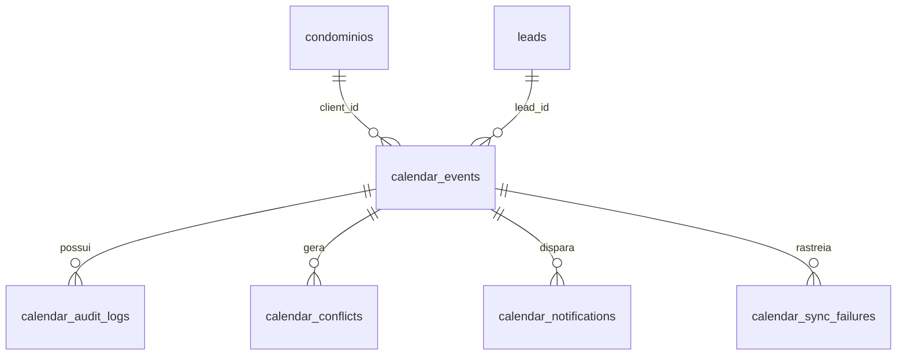

# Documentação Oficial Consolidada — DL Nexus

## 1. Visão Geral da Arquitetura e Negócio
- **Empresa:** DL Soluções Condominiais ME LTDA  
- **CNPJ:** 36.354.697/0001-46  
- **Responsável:** Diogo Luiz de Oliveira  
- **Repositório:** `dlsolucoescondominiais/dl-nexus`  
- **Instância n8n:** `https://n8n.dlsolucoescondominiais.com.br`

O **DL Nexus** é a plataforma de orquestração operacional e inteligência artificial da DL Soluções Condominiais. Focado no atendimento, triagem e precificação de serviços técnicos B2B para condomínios, colégios e comércios no Rio de Janeiro.

---

## 2. Estrutura de Pastas e Mapeamento Documental

```text
projeto_01/
├── DL_NEXUS_V3_LOCAL/
│   ├── 11_N8N_AGENTES_V3/        <- Definição de Agentes e Prompts
│   └── 12_N8N_WORKFLOWS_PROXIMOS/ <- Workflows em JSON para Deploy no n8n
├── backend/
│   └── supabase/                 <- Scripts de Migração e Tabelas SQL
├── scripts/                      <- Scripts Utilitários (Python/JS)
└── docs/                         <- Manuais e Guias de Configuração
```

---

## 3. Estado Atual dos Workflows e Conectividade n8n

Foram analisados **72 workflows** na API do n8n:
- **67 Ativos** ✅
- **5 Inativos com bloqueio/dependência legítima:**

| Workflow | Motivo do Bloqueio | Ação Corretiva |
|---|---|---|
| `179_TESTES_PRECIFICACAO` | Depende do sub-workflow `170` (Inativo) | Publicar/Ativar `170_MOTOR_PRECIFICACAO` primeiro |
| `070_CRON_MARKETING_INSTITUCIONAL_DL_OPENAI` | Depende do sub-workflow `020` (Inativo) | Publicar/Ativar `020_PUBLICADOR_SOCIAL` primeiro |
| `182_GERADOR_PROPOSTA_CATALOGO` | Sem nó de Trigger | Adicionar Cron ou Webhook de disparo |
| `007_Inbound_Omnichannel` | Workflow arquivado | Desarquivar no painel do n8n se necessário |
| `ZELADOR_DRIVE_EXECUTOR_SEGURO_V1` | Sem nó de Trigger | Adicionar gatilho manual ou Cron |

---

## 4. Estrutura do Banco de Dados (Supabase Migration V10)

O arquivo [MIGRATIONS_DL_NEXUS_V10.sql](file:///d:/AntiGravity/projeto_01/backend/supabase/MIGRATIONS_DL_NEXUS_V10.sql) consolidou a estrutura de governança de agenda da DL Soluções:



### Tabelas Criadas:
1. **`calendar_events`**: Cadastro de compromissos operacionais (Avaliações, Instalações, Manutenções) com soft delete (`deleted_at`).
2. **`calendar_audit_logs`**: Histórico detalhado de alterações nos eventos (Quem alterou, data e objeto `old_data`/`new_data`).
3. **`calendar_conflicts`**: Identificação e controle de sobreposições de horários e margens de deslocamento.
4. **`calendar_notifications`**: Controle e log de lembretes enviados (24h antes, 3h antes) prevenindo envio duplicado.
5. **`calendar_sync_failures`**: Fila de controle de retentativas (retries) com backoff exponencial.
6. **`calendar_rules`**: Parâmetros de funcionamento (Working Hours, Mapeamento de Cores do Google Calendar e Margens de Segurança).

---

## 5. Pendências e Ações Recomendadas

1. **Reativação do Supabase**: O domínio de host `db.nejdtvkpiclagsnfljsz.supabase.co` não está resolvendo. Acesse a plataforma do Supabase para reativar o banco da pausa por inatividade.
2. **Executar Migração V10**: Assim que o banco estiver ativo, rode o script local `scripts/execute_remote_sql_v10.py` para aplicar as novas tabelas da agenda.
3. **Mapeamento de Cores do Calendar**: Configurar no Google Calendar as IDs especificadas em `calendar_rules`:
   - `AVALIACAO`: 4 (Amarelo/Banana)
   - `INSTALACAO`: 11 (Vermelho/Tomate)
   - `MANUTENCAO`: 5 (Verde/Sálvia)
